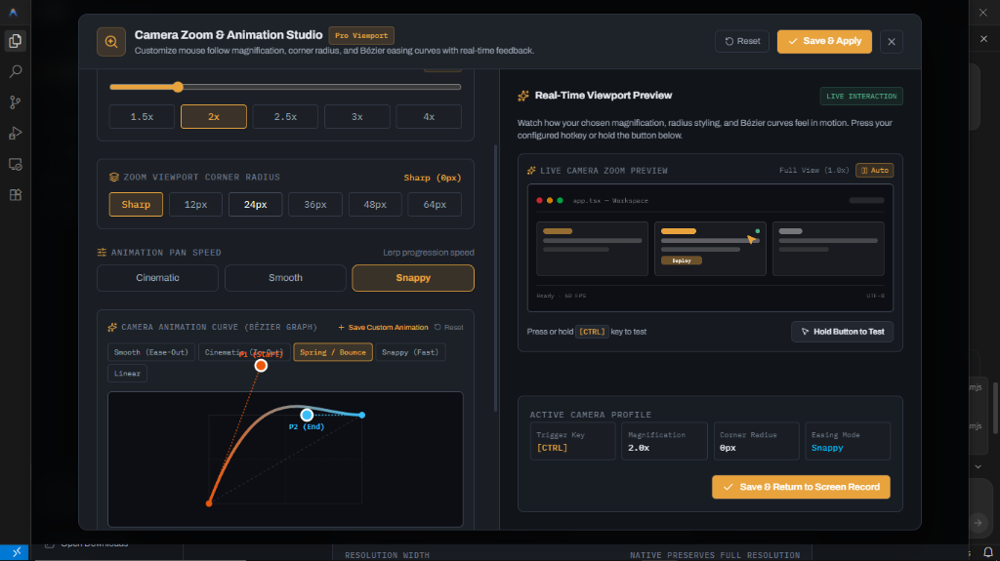
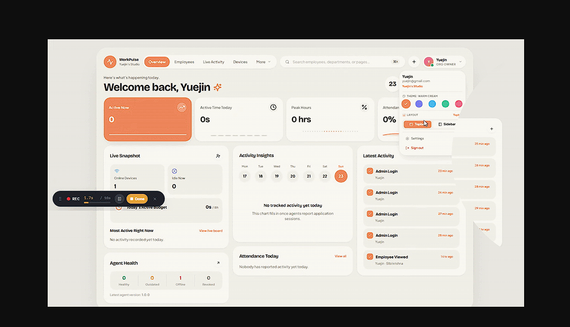
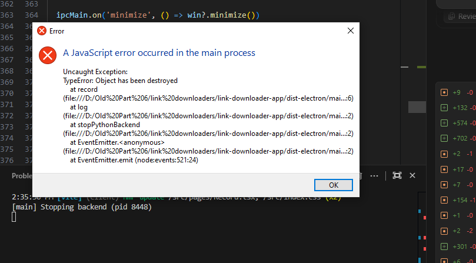
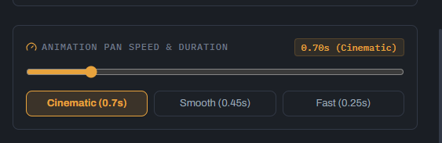

# Bench

A modern desktop workbench for pulling video off the web, editing footage locally, and recording screens with buttery-smooth Bézier zoom tracking.

Electron and React on the front, a Python/FastAPI sidecar wrapping yt-dlp, ffmpeg and OpenCV on the back. Everything runs locally on your machine.

---

## 📸 Preview & Screenshots

### 1. Camera Zoom & Animation Studio


### 2. Moveable Screen Recorder & Mini Widget


### 3. Interactive Bézier Graph Curve Editor


### 4. Precision Animation Speed & Duration Controls


---

## The Window Layout

```
┌────────────────────────────────────────────────────────────┐
│ Bench │ ● Backend ready                        ─  □  ✕    │  Title bar
├───────────────┬────────────────────────────────────────────┤
│  Download     │  Download                                  │
│  Clip         │  Save a video, or pull just its audio…     │
│  Segment      │  ┌──────────────────────────────────────┐  │
│  Inspect      │  │ Paste a video URL     [Fetch formats]│  │  Tool view
│  GIF          │  └──────────────────────────────────────┘  │
│  Edit         │  ┌──────────────────────────────────────┐  │
│  Record       │  │ FORMAT      BAR LENGTH = FILE SIZE   │  │  Format ladder
│               │  │ 4K    vp9  ████████████     1.3 GB   │  │
│               │  │ 1080p h264 █████             246 MB  │  │
│               │  │              Selected 1080p [Download]│ │
│  ───────────  │  └──────────────────────────────────────┘  │
│  TRANSFERS    │  ┌──────────────────────────────────────┐  │
│  ▸ clip.mp4   │  │ SAVED                     Complete   │  │  Result panel
│    62% · 2MB/s│  │ C:\Users\…\clip.mp4      [Show file] │  │
│               │  └──────────────────────────────────────┘  │
│  Open Downloads  │ ▾ ACTIVITY 12 · 0 errors   [Clear]…   │  │  Activity log
└───────────────┴────────────────────────────────────────────┘
```

### 1. Title bar

App name, a real-time status dot, and window controls. The dot is the real state of the Python backend:

| Dot | Meaning |
|---|---|
| Amber — *Starting backend* | Launching local FastAPI sidecar. |
| Green — *Backend ready* | Answering on port 8000. All tools operational. |
| Red — *Backend not running* | Hover for error diagnostics; Activity log displays traceback. |

---

### 2. Left Rail & Available Tools

| Menu Item | Description |
|---|---|
| **Record** | Floating moveable screen recorder. Features **Smooth Cursor Zoom**, interactive **Bézier Easing Studio**, 15-60 FPS capture, and dual **MP4 / GIF** conversion. |
| **Edit** | Lossless video trimmer (instant ffmpeg stream copy) and visual drag-and-drop crop bounding box editor with aspect ratio presets (`16:9`, `9:16`, `1:1`, `4:3`). |
| **Download** | Fetches all available streams as a visual size ladder. Download single resolutions up to 4K or extract audio alone as MP3. |
| **Clip** | Extracts full-resolution source video segments directly from YouTube `/clip/` links. |
| **Segment** | Cuts precise ranges out of long online videos by timecode without downloading the full stream. |
| **Inspect** | Measures local video metrics: resolution, codec, bitrate, and an OpenCV sharpness Laplacian score to detect fake upscales. |
| **GIF** | Converts local videos to high-efficiency animated GIFs with custom palettes, fps, and widths. |

---

## 🎥 Camera Zoom Studio & Screen Recording Features

- **Pro Viewport Simulation**: 2-column studio layout featuring real-time motion playback, hotkey triggers, and corner radius styling (`0px Sharp` to `64px Pill`).
- **Bézier Easing Curves**: Custom cubic-bezier graph editor with 1:1 SVG coordinate tracking, direct numeric inputs (`P1 X, Y`, `P2 X, Y`), and string curve paste/import (supports CSS, Framer, and Figma formats).
- **100% Browser-Safe Triggers**: Zero-conflict triggers (`Middle Mouse Scroll Click`, `~ Tilde`, `Z`, `C`, `Caps Lock`, `F2`) so normal web clicks never trigger "Open in new tab" shortcuts.
- **Toggle Mode & Hold Mode**: Choose between holding keys to zoom or single-tap toggle to interact with both hands free.
- **Anti-Throttling Engine**: 120Hz DPI-aware cursor tracking and dual-driver canvas loop keeping 60 FPS GPU rendering active even when the window is hidden in background.

### 5. Activity log

Each tool keeps **its own log** — the GIF log does not fill with download
chatter. Lines are tagged by source:

- `download` / `clip` / `segment` / `inspect` / `gif` — that tool's own events
- `backend` — output from the Python process
- `system` — app and backend lifecycle

Backend and system lines appear under every tool, deliberately: a backend
failure is usually why a tool failed. Errors are red and counted in the header.

It is collapsed while things work and opens automatically when the backend is
not ready. *Clear log* empties the current tool's log — distinct from the
*Clear* in the page header, which resets that tool's inputs. *Restart backend*
relaunches the Python process, and *File* reveals `bench.log`, which mirrors
everything to disk so a crash that closes the window is still diagnosable.

Downloads land in your Downloads folder.

## Setup

Requires **Node 20+**, **Python 3.10+**, and **ffmpeg on your PATH**.

```bash
npm install
npm run setup:backend   # creates python_backend/.venv and installs pinned deps
npm run dev
```

`setup:backend` is not optional. The backend runs from `python_backend/.venv`,
and without it every feature fails, because all of them talk to the local API.

To check ffmpeg is visible:

```bash
ffmpeg -version
```

Without it, Bench falls back to pre-merged formats — no 4K, no MP3 extraction —
and Inspect won't run at all.

## Scripts

| Command | Purpose |
|---|---|
| `npm run dev` | Vite dev server plus Electron, backend started automatically |
| `npm run build` | Typecheck and build the renderer |
| `npm run package` | Build, then produce an installer via electron-builder |
| `npm run backend` | Run the Python API on its own, for debugging |
| `npm run lint` / `npm run typecheck` | Static checks |

## How it fits together

The Electron main process picks the first free port from 8000, starts the
backend with `BENCH_PORT` set, and polls `GET /` until it answers before
reporting `ready` to the renderer. The titlebar shows that state, so when the
backend is down the UI says so rather than leaving dead buttons.

Downloads stream progress over a WebSocket at `/api/ws`; GIF conversion streams
over SSE at `/api/convert_gif_stream`. Metadata (`/api/info`) and file
inspection (`/api/check_quality`) are plain POSTs.

## Signed-in downloads

Some videos need your session. Export cookies with a browser extension, then:

```bash
python python_backend/save_cookies.py exported.json
```

That writes `cookies.txt` in the project root, where the backend looks for it.
**`cookies.txt` holds live credentials and is gitignored — keep it that way.**

## Media behaviour worth knowing

- **Audio is always AAC when the output is MP4.** `bestaudio` usually resolves
  to Opus because it is the higher bitrate, but Opus inside an MP4 is not
  decodable by most Windows players and the file plays silent. AAC is picked
  instead wherever the result is muxed to MP4.
- **Ranges are cut on keyframes.** Without this ffmpeg copies from the nearest
  *preceding* keyframe and marks the earlier frames "discard" with negative
  timestamps, so the clip opens on several seconds of frozen video while the
  audio runs ahead. Cutting on keyframes re-encodes around the cut points, which
  costs a little time and makes the clip start clean and stay in sync.
- **Segment and Clip run signed out.** A range download is handed to ffmpeg, and
  yt-dlp does not give it the cookie jar, so a URL resolved against a signed-in
  session comes back `403`. Public videos work; private and age-restricted ones
  do not, through those two tools.
- **A stale cookie jar is survivable.** Expired cookies fail every request with
  "The page needs to be reloaded". Bench detects that, retries signed out, and
  says so in the log. Re-export `cookies.txt` to restore signed-in access.

## Notes

- **yt-dlp is pinned** in `python_backend/requirements.txt`. It tracks site
  changes constantly, so when a site stops working, bump it first:
  `python_backend/.venv/Scripts/pip install -U yt-dlp`.
- **The UI follows a written design system**, `.claude/skills/bench-ui/SKILL.md`
  — type scale, spacing steps, neutral ramp and button specs. Read it before
  adding a screen so new work matches the existing views.
- **TypeScript is held at 6.0.3.** typescript-eslint refuses to run against
  TypeScript 7, so the linter and the compiler can't both be on latest yet.
  Revisit when typescript-eslint ships TS 7 support.
- Node is used by yt-dlp for YouTube signature solving and is found on your
  PATH. Set `BENCH_NODE_PATH` to point at a specific binary if needed.
- `BENCH_REMOTE_COMPONENTS=1` lets yt-dlp fetch JS helpers from GitHub at
  download time. Off by default: it needs network access and is a supply-chain
  surface.

## Packaging

Use `build.bat` — it does the whole thing, in order, and cleans up first.

```
build.bat            full build to the last folder used (default "D:\linkdownload testing")
build.bat "C:\out"   build there, and remember it for next time
build.bat --fast     skip the PyInstaller step and reuse the last backend.exe
```

It freezes `backend.exe` with PyInstaller, type-checks and builds the renderer,
then packages the installer. Before packaging it deletes the previous
installer, `win-unpacked`, and any Bench installed **inside** the output folder,
so there is never a stale copy left to launch by mistake. Installs elsewhere are
untouched.

`--fast` cuts a rebuild to about a minute; use it when only the UI changed, as
the backend takes several minutes to freeze and rarely changes.

`build.bat` must keep **CRLF line endings** — `cmd.exe` mis-parses parenthesised
blocks in an LF-only batch file, which makes it execute fragments of its own
comments. `.gitattributes` pins this.

`npm run package` still works for a bare electron-builder run, but it assumes
`python_backend/dist/backend.exe` already exists.

## License

MIT
